# 목차
- [목차](#목차)
- [업무 결재 시스템, DocuPoint 📑](#업무-결재-시스템-docupoint-)
- [프로젝트 소개](#프로젝트-소개)
- [백엔드](#백엔드)
    - [1. 기술 스택](#1-기술-스택)
    - [2. 헥사고날 아키텍처](#2-헥사고날-아키텍처)
    - [3. 패키지 구조](#3-패키지-구조)
    - [4. DB 및 Entity 설계 : DB 스키마](#4-db-및-entity-설계--db-스키마)
    - [4. DB 및 Entity 설계 : ERD](#4-db-및-entity-설계--erd)
    - [5. 테스트 코드](#5-테스트-코드)
- [최종 결과물](#최종-결과물)

# 업무 결재 시스템, DocuPoint 📑

> 수행한 업무에 대한 **문서 작업**의 기여도 포인트를 요청하고 승인하는 **결재 시스템**

- 기간 : 🗓️ **2024.04 ~ 2024.05**
- 인원 : 프론트 1명, **백엔드 1명(✅)**
- 기술 스택 : **`Spring`, `SpringBoot`, `JPA`, `MySQL`, `Spring Security`, `QueryDSL`**
- Back-end
  - **헥사고날 아키텍처(포트-어댑터)** 적용하여 변경에 유연한 구조 설계
  - CQRS 패턴 적용
  - QueryDSL **페이지네이션 및 필터링** 구현
  - Service, Repository **테스트 커버리지** Line 기준 **100% 달성**

# 프로젝트 소개

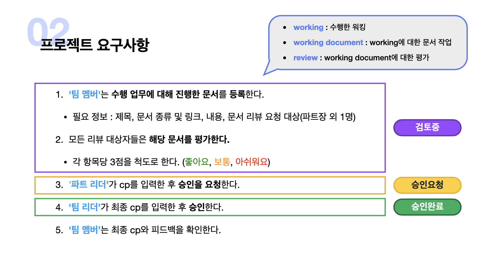
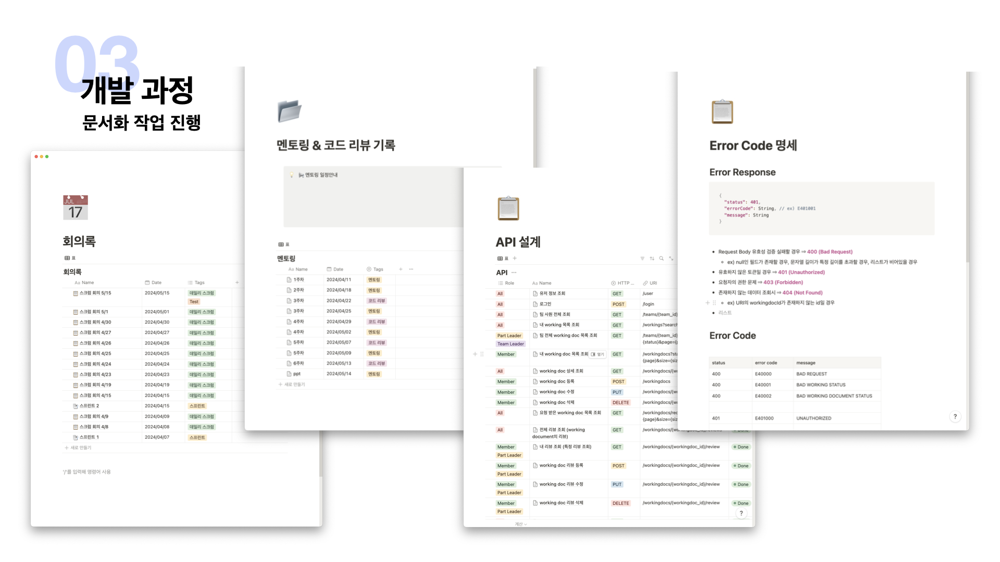

# 백엔드
### 1. 기술 스택
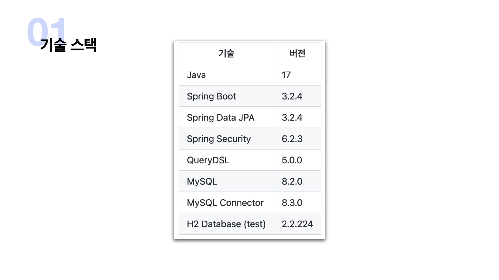
### 2. 헥사고날 아키텍처
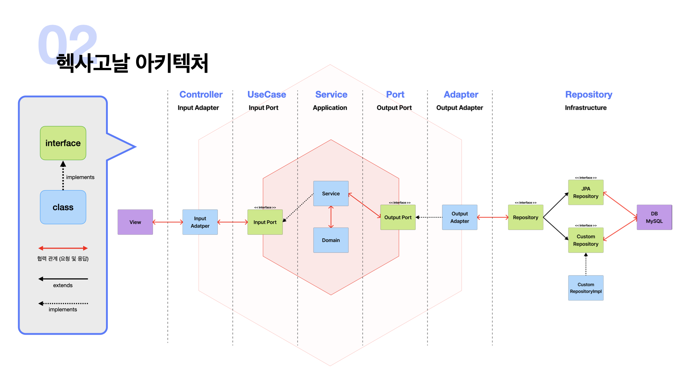
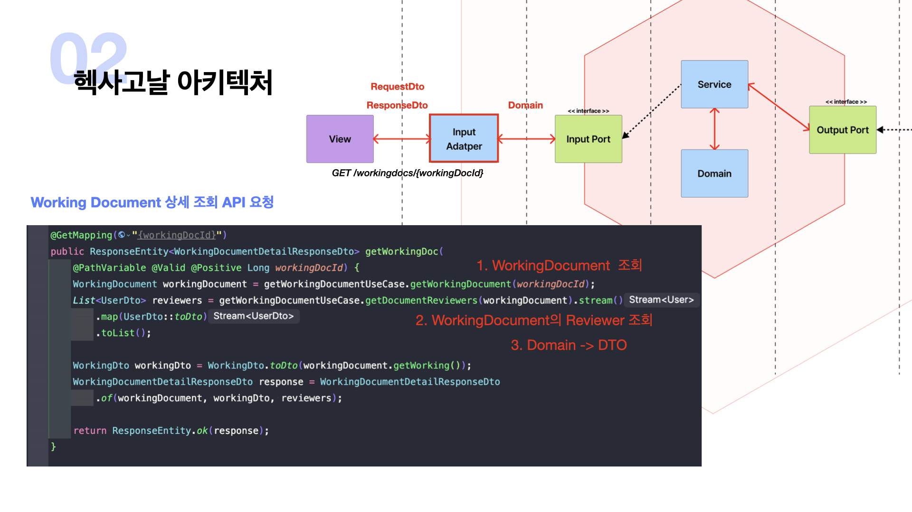
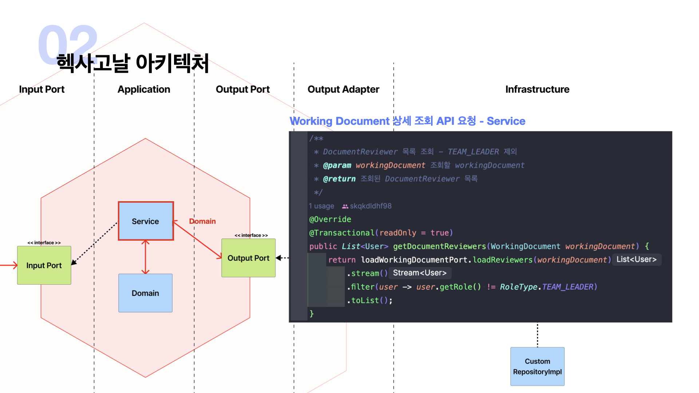
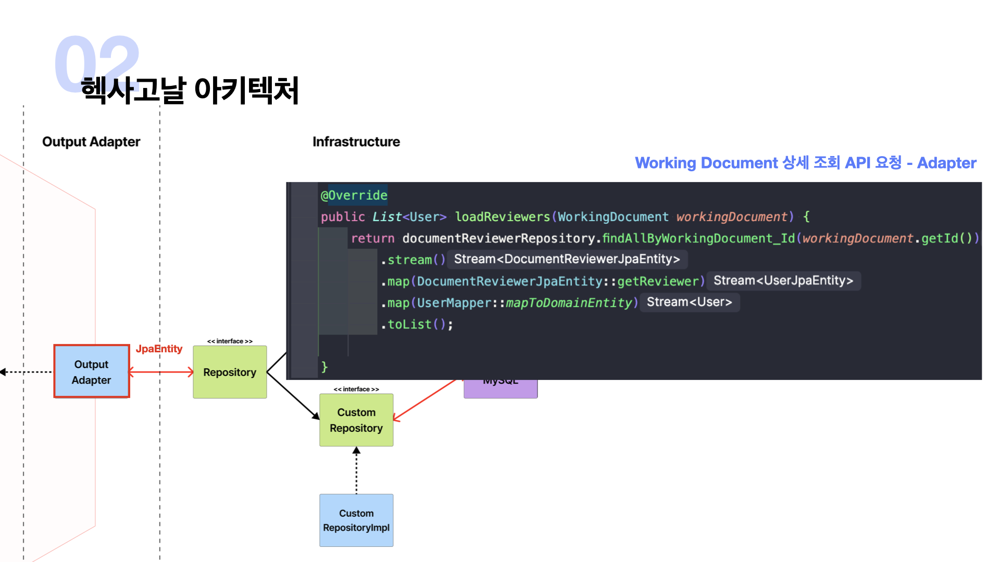
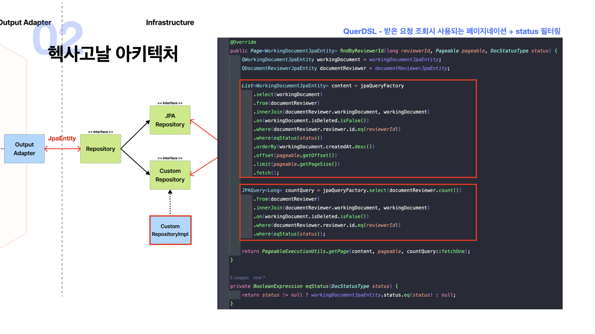
### 3. 패키지 구조

### 4. DB 및 Entity 설계 : DB 스키마 
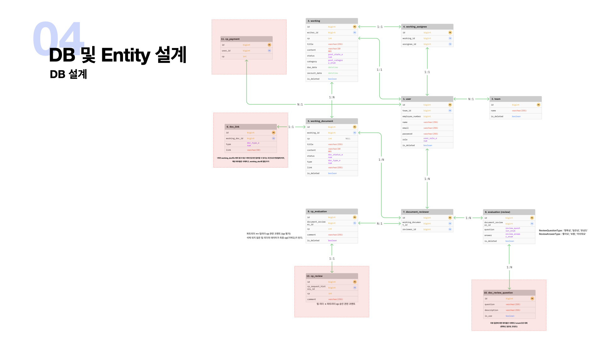
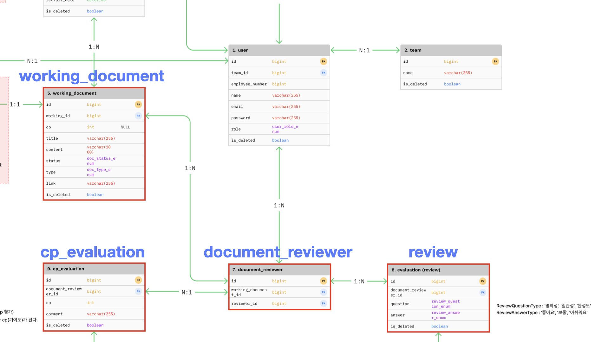
### 4. DB 및 Entity 설계 : ERD
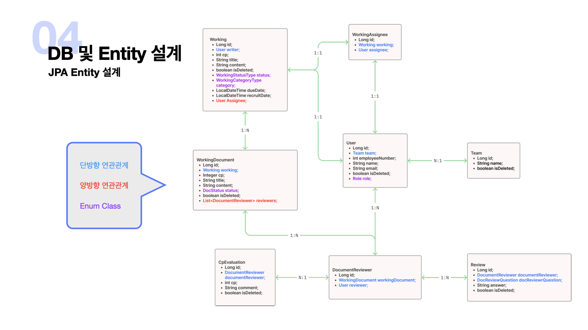
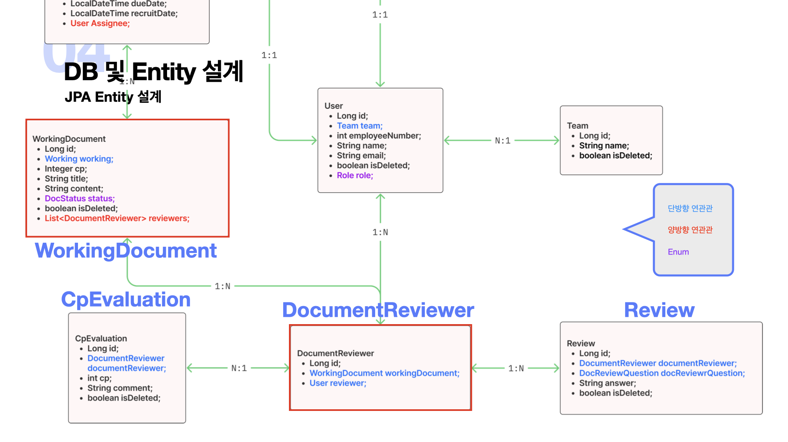
### 5. 테스트 코드

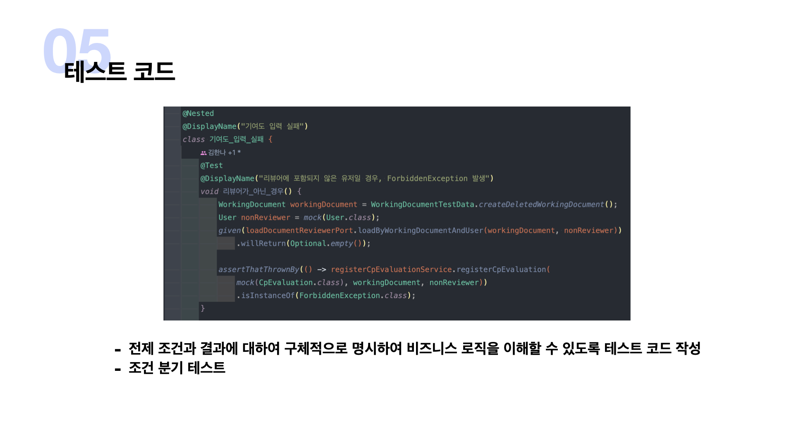

# 최종 결과물
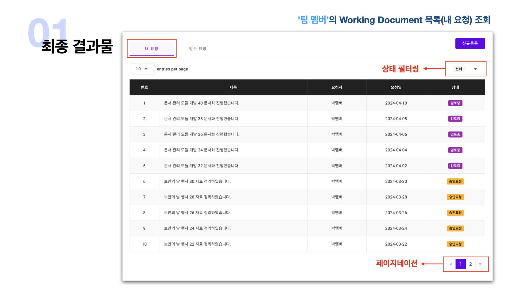

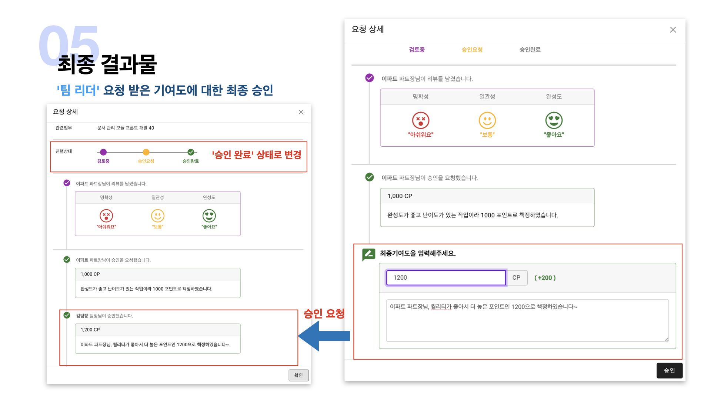
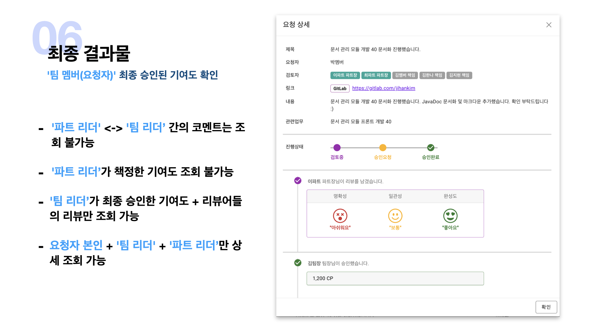

    

